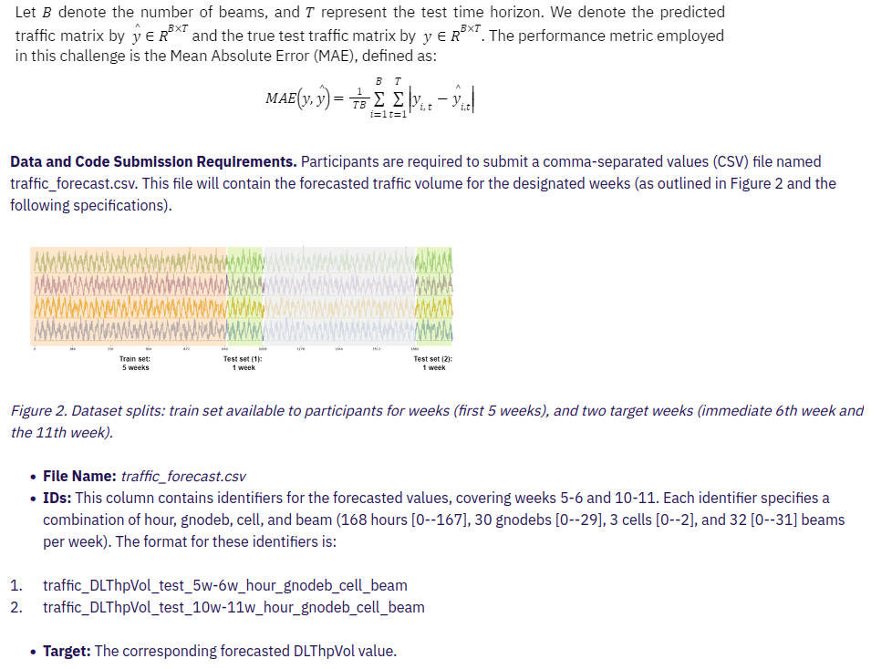

# Spatio-Temporal Beam-Level Traffic Forecasting Challenge by ITU
This competition introduces a new challenge within the field of spatio-temporal forecasting. The challenge centers on forecasting traffic throughput volumes within communication networks (as illustrated in Figure 1). Precise prediction of traffic volume holds significant importance for optimizing network flow and resource allocation, thereby rendering this task highly relevant to the scientific community in the domains of networking and machine learning. To effectively address this challenge, the competition necessitates the development of solutions leveraging state-of-the-art (SOTA) forecasting machine learning models capable of analyzing complex, multivariate time series data.

A distinguishing feature of this challenge is the provision of high-resolution, beam-level throughput data with precise hourly granularity. Furthermore, the dataset encompasses not only throughput volume, but also throughput time, Physical Resource Block (PRB) utilization, and user count.

The objective of this challenge is to develop a multivariate time series forecasting model for traffic volume (DLThpVol) at the beam level. This model will be trained on high-resolution data to capture the intricacies of real-world traffic scenarios.

By leveraging machine learning expertise, participants will design and implement models that surpass the accuracy of baseline models provided. Successful development of such models has the potential to revolutionize traffic management practices, yielding societal benefits such as energy conservation, reduced network congestion, improved user experiences, and enhanced environmental sustainability.

## Evaluation

### How to run the codes:
Run the PART1_Spatio-Temporal_turn_to_parquet notebook that takes in the original zindi data provided and generates new datasets that we will use in subsequent steps. Store this in a folder called prepared_data and note this path as from here we will only use the data present in this prepared data folder
Run the Spatio_temporal_feature_engineering notebook to generate new files with feature engineered data. Takes around 1hr 30min and should run in  google colab pro with high memory as the data is so large
After that you can run the spatio_temporal_catboost_modelling which takes nearly 10 hrs to run and also should run in a high memory environment and the spatio_temporal_lightgbm_modelling which takes nearly 4hrs to run in a high memory environment. Both of this can also run on Kaggle kernels and they take approximately same amount of hours.
Lastly run the ensemble notebook to reproduce my best sub on the leaderboard

### Results
https://zindi.africa/competitions/spatio-temporal-beam-level-traffic-forecasting-challenge/leaderboard

* Public Leaderboard - 0.191948815
* Private Leaderboard - 0.2261804
